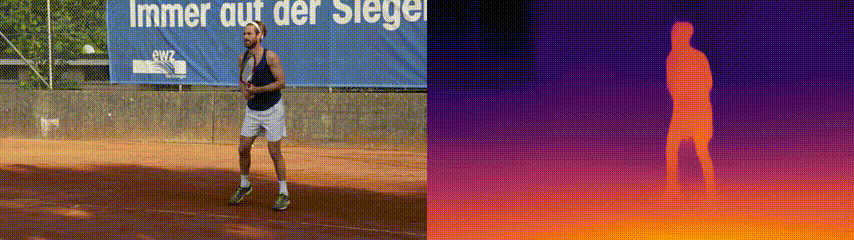

<h2 align="center">TCMonoDepth: Enforcing Temporal Consistency in Video Depth Estimation</h2>



**<p align="center">TCMonoDepth is a method for stable depth estimation for any video.</p>**

**<p align="center">TCMonoDepth 是一个为任意视频估计稳定的深度值的模型。</p>**

<p align="center">
  <a href="https://openaccess.thecvf.com/content/ICCV2021W/PBDL/papers/Li_Enforcing_Temporal_Consistency_in_Video_Depth_Estimation_ICCVW_2021_paper.pdf">Paper</a>
</p>

## Usage ##

#### Requirements

- [x] python
- [x] pytorch
- [x] torchvision
- [x] opencv
- [x] tqdm

#### Testing

You can download our pretraind checkppont from [link](https://drive.google.com/file/d/1MGefuek7_fW_9vu5bP6l0IIF72tg-n-M/view) (google drive)  or [link](https://pan.baidu.com/s/1CAQwT5CL7-YH4CCYCyplUA) (百度云, 提取码: w2kr) and save it in the`./weights` folder.  Put your video into the folder `videos` and run


```shell
cd TCMonoDepth
python demo.py --model large --resume ./weights/_ckpt.pt.tar --input ./videos --output ./output --resize_size 384
```


## A small MonoDepth model for mobile devices

A lightweight and very fast monodepth model

```shell
cd TCMonoDepth
python demo.py --model small --resume ./weights/_ckpt_small.pt.tar --input ./videos --output ./output --resize_size 256
```


## Bibtex

If you use this code for your research, please consider to star this repo and cite our paper.

 ```
 @inproceedings{li2021enforcing,
  title={Enforcing Temporal Consistency in Video Depth Estimation},
  author={Li, Siyuan and Luo, Yue and Zhu, Ye and Zhao, Xun and Li, Yu and Shan, Ying},
  booktitle={Proceedings of the IEEE/CVF International Conference on Computer Vision Workshops},
  year={2021}
}
 ```

## Acknowledgement
In this project, parts of the code are adapted from:
[MiDaS](https://github.com/isl-org/MiDaS).
We thank the authors for sharing codes for their great works.